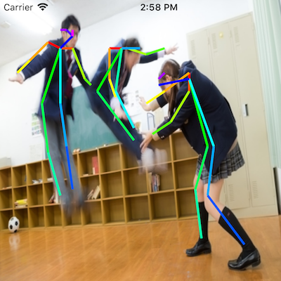
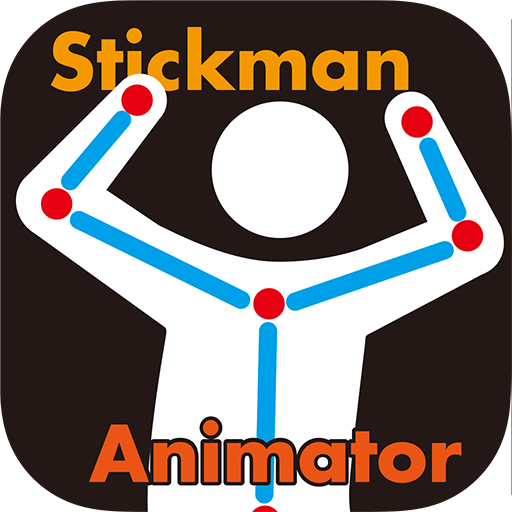

# SwiftOpenPose

This project was developed by transplanting [tf-openpose](https://github.com/ildoonet/tf-openpose) to Swift.  
Community cooperation is welcome.  



## Environment
* iOS11
* Xcode9

## Training Model

There are two learning models available for this project.

* OpenPose Caffe-Model
  * [Convert from OpenPose Caffe-Model to MLModel](doc/CaffeToMLModel.md)
* tf-openpose Mobilenet Model (instance_normalization Disabled Version)
  * [infocom-tpo/tf-openpose](https://github.com/infocom-tpo/tf-openpose/tree/master/convert) .. Model Training and Converter
  * [MobileOpenPose.mlmodel](https://s3-ap-northeast-1.amazonaws.com/swiftopenpose/MobileOpenPose.mlmodel) .. Model Download

## Performance comparison

* BenchMark Hardware: iPad 2017
  * OpenPose Caffe-Model
    * processing time .. range 2-4 Sec.
  * tf-openpose Mobilenet Model
    * processing time .. Less than 1 sec

## Dependencies Library

* [UpSurge](https://github.com/aleph7/Upsurge)
* [OpenCV](https://opencv.org/releases.html)
  * Download of iOS Pack
  * [Opencv lightweight version](doc/openpose_minimum.md)

## Installation

```
$ git clone https://github.com/infocom-tpo/SwiftOpenPose.git
$ cd SwiftOpenPose
$ pod install
$ curl -o SwiftOpenPose/Resources/MobileOpenPose.mlmodel \
https://s3-ap-northeast-1.amazonaws.com/swiftopenpose/MobileOpenPose.mlmodel
```

## Examples

* [Bone Detecter](examples/BoneDetecter)  
This app exports a video with detected bones to photo library.  
You can shoot or select a video to detect bones.


## iTunes Store App

  

[Stickman Animator](https://itunes.apple.com/jp/app/stickman-animator/id1337589939?mt=8)

Stickman Animator is an app to make animations of stickman from videos of people.

## Blogs

* Explanation by Japanese
  * [AI初心者がOpenPoseのモバイル実装に取り組んだ話](https://qiita.com/otmb/items/b924b5f600db1ce11037)

## Reference

* [OpenPose](https://github.com/CMU-Perceptual-Computing-Lab/openpose)
* [tf-openpose](https://github.com/ildoonet/tf-openpose)
* [OpenPose Caffe Model Convert to CoreML Model](https://gist.github.com/otmb/7b2e1caf3330b97c82dc217af5844ad5)
* [エネルギー波を繰り出す女子高生](https://www.pakutaso.com/20151016274post-6129.html)

## Development By Infocom TPO

[Infocom TPO](https://lab.infocom.co.jp/)

## License

SwiftOpenPose is available under the MIT license. See the LICENSE file for more info.

## Citation

```
@inproceedings{cao2017realtime,
  author = {Zhe Cao and Tomas Simon and Shih-En Wei and Yaser Sheikh},
  booktitle = {CVPR},
  title = {Realtime Multi-Person 2D Pose Estimation using Part Affinity Fields},
  year = {2017}
}
```