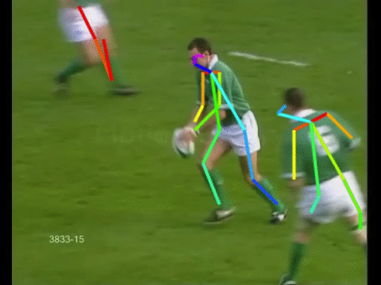

# Bone Detecter  

This project is a sample of SwiftOpenPose.  

Bone Detecter exports a video with detected bones to photo library.  
You can shoot or select a video to detect bones.

## Demo  

## Environment  
* iOS11  
* Xcode9  

## Dependencies Library

* [UpSurge](https://github.com/aleph7/Upsurge)
* [IteratorTools](https://github.com/mpangburn/IteratorTools)
* [OpenCV](https://opencv.org/releases.html)
  * Download of iOS Pack
  * [Opencv lightweight version](doc/openpose_minimum.md)

## Usage  

For using this app, you need to accept requests to access your camera and photo library.

### Shoot a Video to Detect Bones  

1. Tap ● to start recording.  

1. Tap ■ to stop recording.  

1. An original video and a video with detected bones will be exported in photo library.  

### Select a Video to Detect Bones  

1. Tap the thumbnail at the lower left corner of the screen.  
(When there are no videos in photo library, the thumbnail is not displayed)  

1. Select a video.  

1. A video with detected bones will be exported in photo library.  

## Reference

* [UCF Sports Action Data Set](http://crcv.ucf.edu/data/UCF_Sports_Action.php)
    * Used to make Demo and Usage.